# Travaux Pratiques N°5 : Gestion des Exceptions et Généricité en Java

## Description

Ce dépôt contient les solutions des exercices du TP5, portant sur les concepts des Exceptions et de la Généricité en Java.

Les différentes parties du TP abordent :

* Les exceptions système
* Les exceptions personnalisées
* Les checked et unchecked exceptions
* La généricité (Generics) en Java

---

# Partie 1 : Exceptions système

## Liste des Exercices

### 1. Division sécurisée

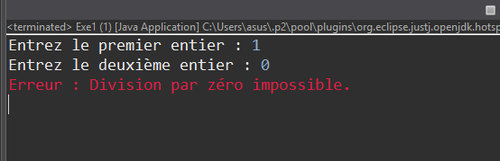

### 2. NullPointerException

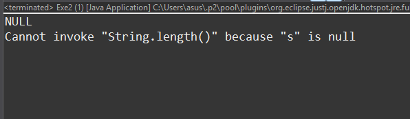

### 3. Tableau sécurisé

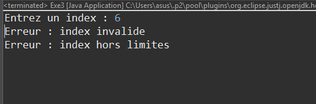

### 4. Conversion d’entier

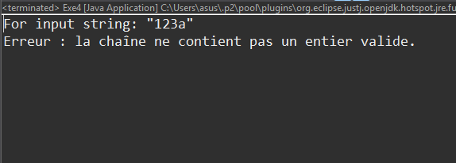

### 5. Racine carrée

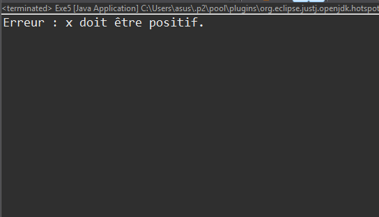

### 6. IllegalStateException

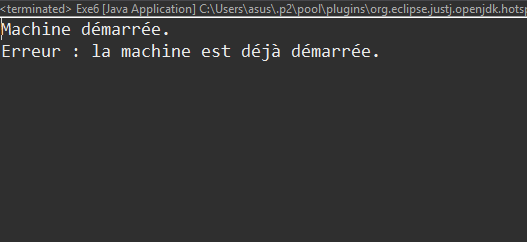

### 7. Propagation des exceptions

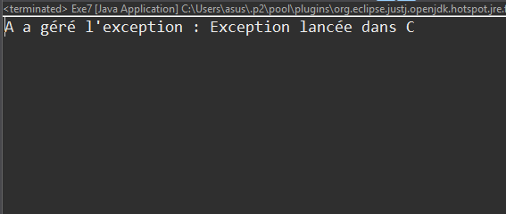

### 8. Checked Exception

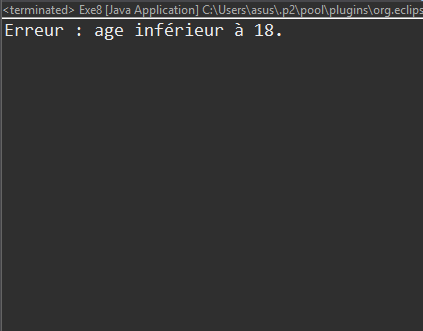

### 9. Comparaison : Exception vs RuntimeException

---

# Partie 2 : Exceptions personnalisées

## Liste des Exercices

### 1. Compte bancaire

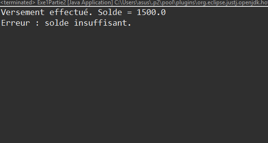

### 2. Montant invalide

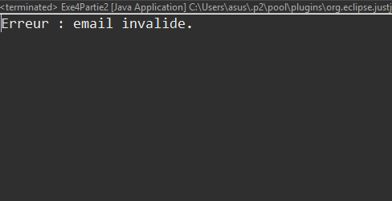

### 3. Double validation

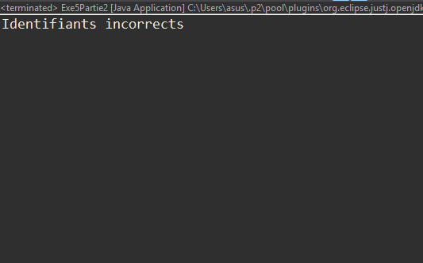

### 4. Inscription utilisateur

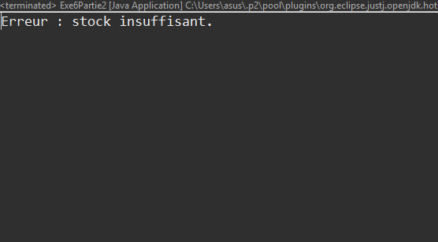

### 5. Authentification

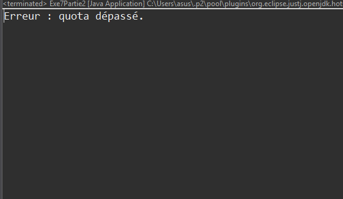

### 6. Gestion de stock

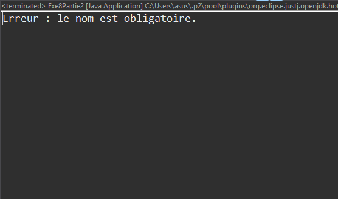

### 7. Téléchargement

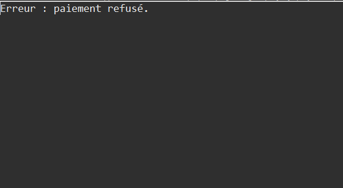

### 8. Validation de formulaire

### 9. Paiement

### 10. Conception : Checked vs Unchecked

## Conception : Checked vs Unchecked Exceptions

Les checked exceptions sont utilisées lorsque l’erreur est prévisible et doit être obligatoirement gérée par le programmeur, comme une erreur de lecture de fichier ou une saisie invalide. Java oblige le développeur à utiliser `try/catch` ou `throws`.

Les unchecked exceptions (RuntimeException) sont utilisées pour les erreurs liées à la logique du programme, comme une division par zéro, un accès à un index invalide ou un objet null. Elles ne sont pas obligatoirement gérées par Java.

Les exceptions personnalisées permettent de créer des erreurs adaptées au contexte de l’application afin de rendre le code plus clair, plus organisé et plus facile à maintenir. Par exemple : `SoldeInsuffisantException` ou `AuthentificationException`.

---

# Partie 3 : Généricité

## Liste des Exercices

### 1. Classe Boite<T>

### 2. Classe Paire<T,U>

### 3. Interface Calcul<T>

### 4. Interface Comparateur<T>
### 5. Comparateur String et Integer

### 6. Méthodes génériques

### 7. Somme générique avec Number

### 8. Héritage générique Animal<T>

### 9. Véhicule générique

### 10. Repository<T>

### 11. Wildcards avec List<?>

### 12. Wildcards avec Number

---

# Structure du Projet

* **/src** : Contient les fichiers sources Java (.java)
* **/screenshots** : Contient les captures d’écran des résultats d’exécution
* **README.md** : Documentation du projet

---

## Auteur

* Ammar
* ENSAH — ID1 S2
